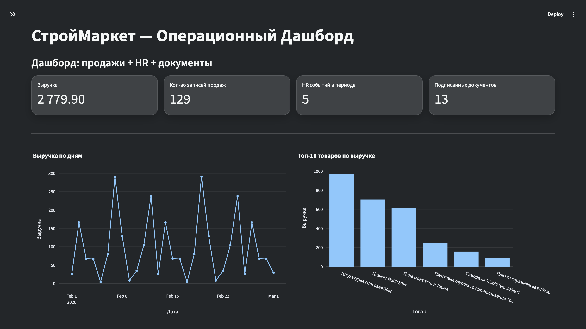

<h2 align="center">
  🧰 СтройМаркет — Операционный дашборд
</h2>

<div align="center">
  
</div>

<br/>

<div align="center">

[](https://forthebadge.com) &nbsp;
[](https://forthebadge.com)

</div>

---

## 🚀 About the Project

**СтройМаркет** — учебный/демонстрационный проект интерактивного дашборда для анализа **продаж** и **HR-операций** строительного ритейла. Приложение позволяет смотреть KPI, графики и таблицы, а также **формировать PDF-отчёт** за выбранный период.

---

## 🛠 Built With

Проект использует современный стек для аналитических приложений на Python:

- **Streamlit** — UI и интерактивная навигация по разделам  
- **SQLite** — локальная база данных для хранения данных  
- **SQLAlchemy** — ORM-модели и работа с БД  
- **Pandas** — подготовка и агрегация данных  
- **Plotly** — интерактивные графики в интерфейсе  
- **Matplotlib** — PNG-графики для отчётов  
- **ReportLab** — генерация PDF-отчёта  
- **python-dotenv** — переменные окружения из `.env`  

---

## ✨ Features

- **📈 Dashboard KPI** — ключевые показатели продаж и активности  
- **🧾 Sales Analytics** — фильтрация по периодам + анализ по товарам/категориям  
- **📦 Products Catalog** — справочник товаров (категории, цены)  
- **👥 HR Events** — кадровые события (приём/отпуск/больничный/увольнение)  
- **📄 HR Documents** — документы со статусами и датами  
- **🗂 PDF Report** — генерация отчёта за период (графики + таблицы)  
- **🎨 Modern Dark UI** — современная тёмная тема с зелёными акцентами  

---

## 🗂 Project Structure

```text
project_activity-4/
├─ app/
│  ├─ __init__.py
│  ├─ main.py                 # Streamlit UI: разделы, метрики, графики, фильтры
│  ├─ config.py               # Настройки приложения (APP_NAME, LOG_LEVEL, DATABASE_URL)
│  ├─ logger.py               # Логирование
│  ├─ models.py               # ORM модели: products, sales, hr_events, hr_documents
│  ├─ db.py                   # Подключение к БД + init_db_and_seed (создание/сидирование)
│  ├─ report_charts.py        # PNG-графики (matplotlib) для PDF-отчёта
│  ├─ pdf_report.py           # Сборка PDF (ReportLab)
│  └─ assets/
│     └─ fonts/               # Шрифты для корректного PDF (кириллица)
│        ├─ DejaVuSans.ttf
│        └─ DejaVuSans-Bold.ttf
├─ data/
│  └─ stroymarket.db          # SQLite база данных (пример данных)
├─ .streamlit/
│  └─ config.toml             # Тема Streamlit (тёмная палитра UI)
├─ .env                       # Переменные окружения (опционально)
└─ requirements.txt           # Зависимости проекта
```

## 🗃 Data & Seeding

При запуске приложение автоматически:
- создаёт таблицы (если их нет),
- гарантирует минимальный объём данных (для демонстрации аналитики),
- работает **идемпотентно**: при повторных запусках не дублирует бесконечно строки, а доводит таблицы до целевых минимумов.

Целевые минимумы:
- `products`: ≥ 20
- `sales`: ≥ 320
- `hr_events`: ≥ 20
- `hr_documents`: ≥ 20

## ⚡ Getting Started

Чтобы запустить проект локально, убедись что установлены Python 3.10+ и Git.

### 1️⃣ Clone the repository

```bash
git clone https://github.com/dv0retsky/analytical-dashboard
```

### 2️⃣ Navigate to project folder

```bash
cd analytical-dashboard
```

### 3️⃣ Create virtual environment

Linux / macOS

```bash
python -m venv .venv
source .venv/bin/activate
```

Windows (PowerShell)

```bash
python -m venv .venv
.\.venv\Scripts\Activate.ps1
```

### 4️⃣ Install dependencies

```bash
pip install -r requirements.txt
```

### 5️⃣ Start the app

```bash
streamlit run app/main.py
```

Приложение будет доступно по адресу: `http://localhost:8501`
Страница автоматически обновляется при изменениях в коде.

## 🖋 Usage Instructions
1. Запусти приложение и перейди по разделам в меню Streamlit:
- Dashboard
- Products
- Sales
- HR Events
- HR Documents
- PDF Report

2. Для отчёта открой раздел **PDF Report**, выбери период и сгенерируй файл.

3. Если нужно пересоздать данные “с нуля”:
- останови приложение,
- удали файл:

```bash
rm -f data/stroymarket.db
```

- запусти приложение снова — БД и данные создадутся автоматически.

## ⚙️ Environment Variables (Optional)

Можно настроить приложение через `.env`:

```bash
APP_NAME=СтройМаркет — Операционный Дашборд
LOG_LEVEL=INFO
DATABASE_URL=sqlite:///./data/stroymarket.db
```

---

<div align="center"> Made with ❤️ by <b>dv0retsky</b> </div>